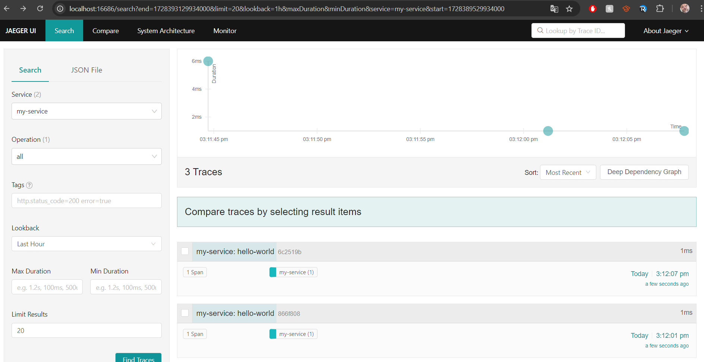

# Blog-post Jaeger

*[Harutjun Harutjunjan, oktober 2024.](https://github.com/hanaim-devops/devops-blog-HHarutjun)*

## Inhoudsopgave

- [Blog-post Jaeger](#blog-post-jaeger)
  - [Inhoudsopgave](#inhoudsopgave)
  - [Inleiding](#inleiding)
  - [Aanleiding](#aanleiding)
  - [Materialen en Methoden](#materialen-en-methoden)
    - [Methodiek](#methodiek)
      - [1. Literatuuronderzoek](#1-literatuuronderzoek)
      - [2. Community Research](#2-community-research)
      - [3. Vergelijkende Analyse](#3-vergelijkende-analyse)
      - [4. Praktijkexperimenten](#4-praktijkexperimenten)
  - [Resultaten](#resultaten)
    - [Resultaat Deelvraag 1: Waar dient Jaeger voor in een DevOps-landschap?](#resultaat-deelvraag-1-waar-dient-jaeger-voor-in-een-devops-landschap)
      - [Het Verschil tussen Monitoring, Tracing en Logging](#het-verschil-tussen-monitoring-tracing-en-logging)
    - [Resultaat Deelvraag 2: Welke voordelen en nadelen biedt Jaeger ten opzichte van andere tracing-tools in een DevOps-context?](#resultaat-deelvraag-2-welke-voordelen-en-nadelen-biedt-jaeger-ten-opzichte-van-andere-tracing-tools-in-een-devops-context)
      - [Voordelen van Jaeger](#voordelen-van-jaeger)
      - [Nadelen van Jaeger](#nadelen-van-jaeger)
    - [Resultaat Deelvraag 3: Wat zijn alternatieven voor Jaeger?](#resultaat-deelvraag-3-wat-zijn-alternatieven-voor-jaeger)
      - [1. SigNoz](#1-signoz)
      - [2. Honeycomb](#2-honeycomb)
      - [3. Tempo by Grafana](#3-tempo-by-grafana)
      - [4. Datadog](#4-datadog)
      - [5. New Relic](#5-new-relic)
      - [6. Aspecto](#6-aspecto)
      - [Toelichting op de gekozen alternatieven](#toelichting-op-de-gekozen-alternatieven)
  - [Resultaten Deelvraag 4: Hoe kan Jaeger in de praktijk worden toegepast op een microservices-applicatie?](#resultaten-deelvraag-4-hoe-kan-jaeger-in-de-praktijk-worden-toegepast-op-een-microservices-applicatie)
    - [Introductie van de Prototype](#introductie-van-de-prototype)
    - [Technische Opzet](#technische-opzet)
    - [Testen van de Applicatie](#testen-van-de-applicatie)
    - [Resultaten van de Tracing](#resultaten-van-de-tracing)
    - [Conclusie](#conclusie)
    - [Aanbeveling](#aanbeveling)
  - [Bronnen](#bronnen)

## Inleiding

In de wereld van moderne softwareontwikkeling en -beheer is het van essentieel belang om inzicht te hebben in de prestaties en betrouwbaarheid van gedistribueerde systemen. Binnen DevOps is monitoring en tracing een belangrijk aspect om de continuïteit van applicaties te waarborgen. Jaeger, een open-source tracing systeem, speelt een cruciale rol in het visualiseren en analyseren van gedistribueerde transacties in microservices-architecturen (Jaeger: Open Source, Distributed Tracing Platform, n.d.).

Jaeger is ontwikkeld door Uber Technologies en stelt ontwikkelaars in staat om prestaties van applicaties te verbeteren door bottlenecks te identificeren, latency te analyseren en inzicht te krijgen in de relaties tussen microservices. In dit onderzoeksverslag wordt onderzocht hoe Jaeger werkt, welke problemen het oplost, en welke voordelen het biedt voor DevOps-teams. Hierbij wordt specifiek gekeken naar de integratie van Jaeger binnen een DevOps-omgeving en hoe het bijdraagt aan continue verbetering van softwarelevering en operationele prestaties (Jaeger: Open Source, Distributed Tracing Platform, n.d.).

## Aanleiding

De snelle opkomst van microservices binnen softwareontwikkeling heeft geleid tot een toenemende behoefte aan tools die de complexiteit van deze architecturen beheersbaar maken. Microservices hebben als voordeel dat ze schaalbaarheid en flexibiliteit bevorderen, maar dit brengt ook uitdagingen met zich mee, vooral op het gebied van monitoring en tracing (Dotan Horovits (@horovits), 2021). De afhankelijkheden tussen verschillende services kunnen leiden tot prestatieproblemen die moeilijk te diagnosticeren zijn zonder de juiste tools. Dit maakt observability een onmisbaar onderdeel van DevOps-praktijken.

Een van de toonaangevende tools op het gebied van distributed tracing is Jaeger. Jaeger biedt inzicht in de communicatie tussen microservices en maakt het mogelijk om problemen zoals latencies, bottlenecks en foutpaden in kaart te brengen (Dinc, 2024). Ondanks de populariteit van Jaeger in het DevOps-landschap, blijft de vraag hoe het efficiënt toegepast kan worden binnen een microservices-architectuur voor specifieke use-cases en DevOps-projecten.

Om dit te onderzoeken, richt dit verslag zich op de volgende hoofdvraag:

**Hoofdvraag:**
**Hoe kan Jaeger efficiënt toegepast worden in een microservices-architectuur binnen een DevOps-omgeving?**

Om de hoofdvraag te beantwoorden, worden de volgende deelvragen onderzocht:

1. Waar dient Jaeger voor in een DevOps-landschap?

2. Welke voordelen en nadelen biedt Jaeger ten opzichte van andere tracing-tools in een DevOps-context?

3. Wat zijn alternatieven voor Jaeger?

4. Hoe kan Jaeger in de praktijk worden toegepast op een microservices-applicatie?

Deze deelvragen bieden een gestructureerd kader om inzicht te krijgen in de mogelijkheden en beperkingen van Jaeger, en de toepasbaarheid ervan binnen DevOps-projecten.

## Materialen en Methoden

In dit onderzoeksverslag wordt gebruikgemaakt van een combinatie van literatuuronderzoek, praktijkexperimenten en vergelijkende analyses om een diepgaand inzicht te verkrijgen in de toepassing van Jaeger binnen een microservices-architectuur in een DevOps-omgeving.

### Methodiek

#### 1. Literatuuronderzoek

Voor het eerste deel van het onderzoek wordt een uitgebreide literatuurstudie uitgevoerd. Hierbij worden relevante boeken, wetenschappelijke artikelen, en online bronnen geraadpleegd om de basiskennis over Jaeger en de rol ervan binnen DevOps te onderzoeken (Hbo-I, n.d.). Dit onderzoek richt zich op de volgende gebieden:

- De werking en architectuur van Jaeger.
- De voordelen van het gebruik van Jaeger in vergelijking met andere tracing-tools.
- Best practices voor implementatie en gebruik in microservices.

#### 2. Community Research

Voor deelvraag 2 wordt er een community research uitgevoerd om de voor- en nadelen van Jaeger te onderzoeken. Hierbij worden verschillende online platforms, zoals forums, discussiegroepen en sociale media, geraadpleegd om de ervaringen van gebruikers te verzamelen (Hbo-I, n.d.). Deze aanpak richt zich op:

- Het analyseren van gebruikersfeedback en beoordelingen van Jaeger.
- Het identificeren van veelvoorkomende problemen en uitdagingen bij de implementatie.
- Het in kaart brengen van de voordelen die gebruikers ervaren bij het gebruik van Jaeger.

#### 3. Vergelijkende Analyse

In dit deel van het onderzoek worden alternatieve tracing-tools vergeleken met Jaeger, zoals Zipkin en OpenTelemetry. Deze vergelijking richt zich op de functionaliteiten, prestaties, en gebruiksgemak van elk systeem Hbo-I (n.d.). De analyse is gebaseerd op:

- Documentatie van de tools.
- Beoordelingen en ervaringen van gebruikers uit online community’s.
- Case studies van implementaties in vergelijkbare omgevingen.

#### 4. Praktijkexperimenten

Voor de praktijkexperimenten wordt een eenvoudig prototype opgezet dat de basisfunctionaliteit van Jaeger demonstreert. Dit prototype, vergelijkbaar met een "Hello World"-project, heeft als doel om een enkele, gesimuleerde service te traceren (Hbo-I, n.d.). De stappen omvatten:

- Het opzetten van een minimalistische applicatie die gebruikmaakt van Jaeger voor tracing.
- Integratie van de Jaeger-client in de applicatie om tracing-gegevens te verzamelen.
- Simulatie van een eenvoudige workflow die door de applicatie gaat, zodat tracing-gegevens kunnen worden gegenereerd en gevisualiseerd.

## Resultaten

### Resultaat Deelvraag 1: Waar dient Jaeger voor in een DevOps-landschap?

Jaeger is een krachtige tool die is ontworpen voor distributed tracing. In een DevOps-landschap speelt Jaeger een cruciale rol in het monitoren en optimaliseren van microservices-architecturen (Dinc, 2024). De belangrijkste toepassingen van Jaeger zijn als volgt:

Jaeger stelt ontwikkelaars en operators in staat om de interacties tussen verschillende microservices te traceren. Dit helpt bij het begrijpen van de flow van aanvragen door het systeem en identificeert welke services betrokken zijn bij een bepaalde transactie. Door de tracing-informatie te analyseren, kunnen teams prestatieproblemen identificeren, zoals vertragingen in de communicatie tussen services, wat hen in staat stelt gerichte optimalisaties door te voeren (Anand, 2023).

Daarnaast biedt Jaeger gedetailleerde informatie over fouten en uitzonderingen die zich kunnen voordoen binnen een microservices-architectuur. Dit is essentieel voor teams die snel problemen willen lokaliseren en downtime willen minimaliseren (Features, n.d.). Jaeger ondersteunt ook visuele hulpmiddelen waarmee gebruikers de communicatie tussen microservices kunnen visualiseren. Deze visualisaties helpen bij het in kaart brengen van de afhankelijkheden tussen services en bieden inzicht in de algehele architectuur (Frontend/UI, n.d.).

Een ander belangrijk aspect van Jaeger is de mogelijkheid om te integreren met monitoringtools zoals Prometheus en Grafana, wat teams een uitgebreide kijk geeft op de prestaties van hun systemen (Monitoring Jaeger, n.d.). Bovendien helpt Jaeger bij het definiëren en monitoren van Service Level Objectives (SLO's) door inzicht te bieden in responsetijden en de beschikbaarheid van microservices (Service Performance Monitoring (SPM), n.d.).

#### Het Verschil tussen Monitoring, Tracing en Logging

In het bredere DevOps-landschap werken **monitoring**, **tracing**, en **logging** samen om de prestaties en gezondheid van een systeem optimaal in de gaten te houden. Elk van deze tools heeft een specifieke rol:

- **Monitoring**: Richt zich op het bewaken van kernstatistieken zoals CPU-gebruik, geheugen en foutpercentages. Het helpt om de algemene gezondheid van het systeem te controleren en geeft waarschuwingen als bepaalde drempelwaarden worden overschreden.
  
- **Tracing**: Dit is waar Jaeger in uitblinkt. Het volgt individuele verzoeken door een gedistribueerd systeem, zodat ontwikkelaars precies kunnen zien hoe een specifieke aanvraag door verschillende microservices stroomt. Dit helpt om bottlenecks of prestatieproblemen te identificeren.
  
- **Logging**: Geeft gedetailleerde gebeurtenissen of foutmeldingen weer die tijdens de uitvoering van het systeem optreden. Logs zijn nuttig voor het achterhalen van specifieke gebeurtenissen of fouten in het systeem.

Deze drie concepten vullen elkaar aan in het proces van systeemobservatie. **Jaeger** richt zich specifiek op **tracing**, wat betekent dat het zich bezighoudt met het volgen van de route van individuele verzoeken door verschillende services binnen een microservices-architectuur. Dit helpt bij het vinden van vertragingen, het opsporen van fouten en het verbeteren van de algehele prestaties van gedistribueerde systemen.

| **Toepassing**                | **Beschrijving**                                                                              |
|-------------------------------|----------------------------------------------------------------------------------------------|
| **Tracing van Microservices** | Helpt bij het begrijpen van de aanvragenflow door het systeem en identificeert betrokken services.  |
| **Prestatieoptimalisatie**    | Maakt het mogelijk om prestatieproblemen te identificeren en gerichte verbeteringen door te voeren. |
| **Foutdiagnose**              | Biedt gedetailleerde informatie over fouten en helpt bij het minimaliseren van downtime.         |
| **Visualisatie**              | Levert inzicht in service-communicatie en afhankelijkheden binnen de architectuur.           |
| **Monitoring Integratie**     | Kan worden geïntegreerd met tools zoals Prometheus en Grafana voor uitgebreide prestatieanalyses. |
| **SLO-ondersteuning**         | Helpt bij het definiëren en monitoren van Service Level Objectives door inzicht te geven in responsetijden. |

### Resultaat Deelvraag 2: Welke voordelen en nadelen biedt Jaeger ten opzichte van andere tracing-tools in een DevOps-context?

Jaeger, als een populaire open-source tracing-tool, biedt verschillende voordelen en nadelen in vergelijking met andere tracing-tools binnen een DevOps-omgeving. Dit resultaat onderzoekt deze aspecten in detail.

#### Voordelen van Jaeger

1. **Open Source en Gratis**  
   Jaeger is een volledig open-source project, wat betekent dat het gratis te gebruiken is en dat gebruikers de mogelijkheid hebben om de broncode aan te passen. Dit bevordert innovatie en stelt teams in staat om de tool aan te passen aan hun specifieke behoeften (Jaeger: Open Source, Distributed Tracing Platform, n.d.).

2. **Uitgebreide Functionaliteit**  
   Jaeger biedt uitgebreide tracing-functionaliteiten, waaronder het volgen van aanvragen door verschillende microservices, ondersteuning voor verschillende dataformaten en integratie met andere monitoringtools zoals Prometheus en Grafana. Dit maakt het een veelzijdige optie voor teams die op zoek zijn naar diepgaande inzichten in hun systemen (Monitoring Jaeger, n.d.). Jaeger biedt zelf nog meer concepten aan dan sommige andere observers zoals spans, traces en services. Dit zorgt voor meer detail en nuance in het analyseren van het systeem (Getting Started With Open Source Tracing: Jaeger Vs. Zipkin, 2024).

3. **Goede Integratie met Microservices**  
   Jaeger is specifiek ontworpen voor microservices-architecturen, waardoor het goed kan samenwerken met moderne cloud-native applicaties. Dit biedt teams de mogelijkheid om hun microservices effectief te traceren en te optimaliseren (Jaeger: Open Source, Distributed Tracing Platform, n.d.).

4. **Visualisatie en Analyses**  
   De visuele interface van Jaeger stelt teams in staat om de flow van aanvragen en de onderlinge afhankelijkheden tussen services eenvoudig te begrijpen. Dit helpt bij het identificeren van bottlenecks en prestatieproblemen (Frontend/UI, n.d.).

5. **Flexibiliteit en Schaalbaarheid**  
   Jaeger is ontworpen om te schalen met de groei van de applicatie. Het kan eenvoudig omgaan met een toenemend aantal aanvragen en microservices, wat belangrijk is voor grote, dynamische omgevingen (Daniel & Daniel, 2024).

#### Nadelen van Jaeger

1. **Complexiteit bij Implementatie**  
   Voor teams die nieuw zijn in distributed tracing kan de implementatie van Jaeger complex zijn. Het vereist een goede kennis van tracing-concepten en kan tijd kosten om correct te configureren en te integreren met bestaande systemen (Getting Started With Open Source Tracing: Jaeger Vs. Zipkin, 2024).

2. **Hogere Resource-eisen**  
   Jaeger kan aanzienlijke middelen vereisen, vooral in omgevingen met een groot aantal microservices en aanvragen. Dit kan leiden tot hogere kosten voor infrastructuur en onderhoud (Anand, 2023).

3. **Beperkte Community Support**  
   Hoewel Jaeger een actieve community heeft, kan de ondersteuning en documentatie minder uitgebreid zijn in vergelijking met commerciële tracing-tools, die vaak uitgebreide klantenservice en ondersteuning bieden (Anand & Anand, 2024).

4. **Afhankelijkheid van Backend Systemen**  
   Jaeger vereist een backend-systeem (zoals Elasticsearch of Cassandra) voor het opslaan van tracegegevens. Dit kan de configuratie en onderhoudscomplexiteit verhogen, vooral in kleinere omgevingen (Daniel, 2024).

| **Voordelen**                   | **Nadelen**                                  |
|---------------------------------|----------------------------------------------|
| Open source en gratis           | Complexiteit bij implementatie               |
| Uitgebreide functionaliteit      | Hogere resource-eisen                        |
| Goede integratie met microservices | Beperkte community support                   |
| Visualisatie en analyses         | Afhankelijkheid van backend systemen         |
| Flexibiliteit en schaalbaarheid  |                                              |

### Resultaat Deelvraag 3: Wat zijn alternatieven voor Jaeger?

Er zijn verschillende alternatieven voor Jaeger die ook kunnen worden gebruikt voor distributed tracing in microservices-architecturen binnen een DevOps-context. Hieronder worden enkele van de meest populaire en breed gebruikte alternatieven besproken, samen met hun kenmerken en toepassingen (Daniel, 2024).

#### 1. SigNoz

SigNoz is een open-source observatietool die de verzameling van metrics, logs en traces ondersteunt. Het biedt een gebruiksvriendelijke interface voor het analyseren van prestaties en het oplossen van problemen (SIGNOZ, n.d.).

- **Kenmerken**:
  - Ondersteunt full-stack observatie.
  - Eenvoudige installatie en configuratie.
  - Real-time gegevensvisualisatie en foutanalyse.

- **Toepassingen**:
  - Geschikt voor teams die een gebruiksvriendelijke en krachtige open-source oplossing willen voor observatie.

#### 2. Honeycomb

Honeycomb is een cloud-gebaseerde observatietool die real-time analytics biedt voor gedistribueerde systemen. Het stelt teams in staat om complexe vraagstukken op te lossen door diepgaande analyses (Honeycomb, 2024).

- **Kenmerken**:
  - Geavanceerde querymogelijkheden en visualisaties.
  - Ondersteuning voor de observatie van microservices en serverless architecturen.
  - Gericht op snelheid en efficiëntie bij het oplossen van problemen.

- **Toepassingen**:
  - Ideaal voor teams die snel inzicht willen krijgen in hun systemen en problemen willen oplossen.

#### 3. Tempo by Grafana

Tempo is een open-source tracing-tool die is ontworpen om te integreren met de Grafana-ecosysteem. Het richt zich op het gemakkelijk verzamelen van trace-gegevens zonder dat daar veel overhead bij komt kijken (Grafana Tempo OSS | Distributed Tracing Backend, n.d.).

- **Kenmerken**:
  - Volledig geïntegreerd met Grafana voor visualisatie.
  - Ondersteunt de OpenTelemetry-standaard.
  - Laag resourcegebruik en eenvoudig te implementeren.

- **Toepassingen**:
  - Geschikt voor teams die al gebruikmaken van Grafana en op zoek zijn naar een eenvoudige manier om tracing toe te voegen aan hun observatiestrategie.

#### 4. Datadog

Datadog is een commercieel monitoring- en observatietool die een breed scala aan functies biedt, waaronder distributed tracing, logmanagement en infrastructuurmonitoring (Datadog, 2016).

- **Kenmerken**:
  - Volledige stack observatie met krachtige integraties.
  - Gebruiksvriendelijke dashboards en analyses.
  - Commerciële ondersteuning en SLA's voor enterprise-klanten.

- **Toepassingen**:
  - Ideaal voor grotere organisaties die behoefte hebben aan uitgebreide ondersteuning en een complete monitoringoplossing.

#### 5. New Relic

New Relic biedt een geïntegreerd platform voor het monitoren van applicaties, infrastructuur en gebruikerservaring. Het biedt geavanceerde tracing-functionaliteiten (New Relic, Inc., n.d.).

- **Kenmerken**:
  - Uitgebreide analytics en monitoringfunctionaliteiten.
  - Integratie met verschillende programmeertalen en frameworks.
  - Robuuste commerciële ondersteuning.

- **Toepassingen**:
  - Geschikt voor teams die op zoek zijn naar een alles-in-één oplossing voor monitoring en tracing met sterke ondersteuning.

#### 6. Aspecto

Aspecto is een observatietool die zich richt op het vereenvoudigen van tracing en observatie voor microservices. Het biedt een visuele interface voor het volgen van aanvragen door verschillende services (Observability Platform Powered by OpenTelemetry, Aspecto, 2023).

- **Kenmerken**:
  - Visuele representatie van traces en afhankelijkheden.
  - Ondersteuning voor meerdere programmeertalen.
  - Real-time monitoring en feedback.

| **Alternatief**   | **Kenmerken**                                                                                | **Toepassingen**                                         |
|--------------------|----------------------------------------------------------------------------------------------|---------------------------------------------------------|
| **SigNoz**         | Full-stack observatie, gebruiksvriendelijke interface                                         | Voor teams die open-source oplossingen willen            |
| **Honeycomb**      | Geavanceerde analytics, gericht op snelheid en efficiëntie                                   | Voor teams die snel problemen willen oplossen            |
| **Tempo**          | Eenvoudige integratie met Grafana, laag resourcegebruik                                      | Voor teams die Grafana gebruiken                          |
| **Datadog**        | Volledige stack observatie, commerciële ondersteuning                                         | Voor grotere organisaties met behoefte aan uitgebreide ondersteuning |
| **New Relic**      | Geïntegreerde monitoring, robuuste commerciële ondersteuning                                   | Voor teams die een alles-in-één oplossing willen        |
| **Aspecto**        | Visuele representatie van traces, real-time monitoring                                        | Voor teams die een gebruiksvriendelijke interface willen |

#### Toelichting op de gekozen alternatieven

1. **SigNoz** is gekozen vanwege zijn open-source karakter en gebruiksvriendelijke interface, waardoor het een aantrekkelijke optie is voor teams die op zoek zijn naar observatie zonder hoge kosten.

2. **Honeycomb** biedt geavanceerde query- en analysemogelijkheden, wat het bijzonder nuttig maakt voor teams die snel inzicht willen krijgen in hun gedistribueerde systemen.

3. **Tempo** is een uitstekende keuze voor teams die al gebruikmaken van Grafana, aangezien het naadloos integreert en trace-gegevens op een laagdrempelige manier verzamelt.

4. **Datadog** en **New Relic** zijn gekozen vanwege hun uitgebreide functionaliteiten en sterke commerciële ondersteuning, wat ze geschikt maakt voor grotere organisaties die een robuuste oplossing nodig hebben.

5. **Aspecto** biedt een visuele interface die het voor teams gemakkelijker maakt om aanvragen en afhankelijkheden te volgen, waardoor het een waardevolle tool is in complexe microservices-architecturen.

Deze alternatieven bieden waardevolle opties voor teams die Jaeger overwegen of die hun observatiestrategieën willen diversifiëren in een DevOps-omgeving.

## Resultaten Deelvraag 4: Hoe kan Jaeger in de praktijk worden toegepast op een microservices-applicatie?

### Introductie van de Prototype

Voor deze deelvraag heb ik een eenvoudige prototype-applicatie ontwikkeld met behulp van Node.js en de Jaeger-client. Het doel was om de functionaliteit van Jaeger in een microservices-architectuur te demonstreren.

### Technische Opzet

De applicatie is opgebouwd met Express als webframework. Ik heb Jaeger geconfigureerd als volgt:

- **Agent Host**: `jaeger` (de naam van de Jaeger-container)
- **Agent Port**: `6831`

De Jaeger-client werd geïntegreerd in de Node.js-applicatie om tracing-informatie te genereren en naar de Jaeger-agent te sturen.

### Testen van de Applicatie

Na het opzetten van de applicatie heb ik deze gestart en aanvragen gedaan via de browser door `http://localhost:3000` te bezoeken. Dit genereerde spans die zichtbaar waren in de Jaeger UI.

### Resultaten van de Tracing

Bij het bezoeken van de service verscheen de trace in de Jaeger UI op `http://localhost:16686`. De trace toonde verschillende spans die de tijd vastlegden die door de applicatie werd besteed aan het verwerken van aanvragen. Dit gaf inzicht in de latency van de service en hielp bij het identificeren van mogelijke prestatieproblemen.

*Figuur 1: interface Jaeger trace my-service*

### Conclusie

In dit onderzoeksverslag is de rol van Jaeger in het DevOps-landschap uitgebreid onderzocht. Jaeger blijkt een essentiële tool te zijn voor het monitoren en traceren van microservices-architecturen. De functionaliteiten van Jaeger, waaronder het traceren van aanvragen, het visualiseren van afhankelijkheden en het optimaliseren van prestaties, dragen bij aan een diepgaand inzicht in de werking van gedistribueerde systemen. Door het identificeren van bottlenecks en latency-problemen kunnen DevOps-teams gerichte verbeteringen doorvoeren, wat uiteindelijk leidt tot een verhoogde applicatieweerstand en betrouwbaarheid.

De evaluatie van de voordelen en nadelen van Jaeger in vergelijking met andere tracing-tools, zoals Zipkin en OpenTelemetry, laat zien dat Jaeger, ondanks enkele uitdagingen bij implementatie en hogere resource-eisen, aanzienlijke voordelen biedt in termen van functionaliteit en integratie met moderne microservices. Het open-source karakter van Jaeger bevordert daarnaast aanpassing aan specifieke teambehoeften en stimuleert innovatie.

### Aanbeveling

Op basis van de bevindingen van dit onderzoek, worden de volgende aanbevelingen gedaan voor teams die Jaeger of alternatieve tracing-tools willen implementeren in hun DevOps-omgeving:

1. **Implementatie en Training**  
   DevOps-teams die Jaeger willen implementeren, moeten investeren in training en kennisdeling rond distributed tracing. Het begrip van tracing-concepten is cruciaal voor een succesvolle integratie en benutting van Jaeger.

2. **Integratie met Monitoring Tools**  
   Het is raadzaam om Jaeger te integreren met andere monitoringtools zoals Prometheus en Grafana. Dit biedt een holistisch beeld van de systeemstatus en prestaties, en stelt teams in staat om problemen sneller te diagnosticeren.

3. **Experimenteren met Alternatieven**  
   Hoewel Jaeger aanzienlijke voordelen biedt, is het zinvol voor teams om ook alternatieve tracing-tools zoals SigNoz of Tempo te overwegen. Dit kan hen helpen om de meest geschikte oplossing voor hun specifieke behoeften te vinden.

4. **Optimalisatie van Resourcegebruik**  
   Teams moeten aandacht besteden aan de resource-eisen van Jaeger, vooral in grote omgevingen. Het kan nuttig zijn om performance-testen uit te voeren om te bepalen hoe Jaeger zich gedraagt onder verschillende belastingniveaus.

5. **Community Engagement**  
   Deelname aan de Jaeger-community kan waardevolle inzichten opleveren over best practices en nieuwe ontwikkelingen. Teams kunnen profiteren van gebruikerservaringen en tips die zijn verzameld uit de community.

Door de bovenstaande aanbevelingen op te volgen, kunnen DevOps-teams de effectiviteit van Jaeger maximaliseren en een betrouwbare monitoring- en tracing-infrastructuur opbouwen die bijdraagt aan de continue verbetering van softwarelevering en operationele prestaties.

## Bronnen

- Jaeger: open source, distributed tracing platform. (n.d.). https://www.jaegertracing.io/
- Dinc, E. (2024, January 1). Distributed Tracing with Jaeger and OpenTelemetry in a Microservices Architecture. Medium. https://medium.com/@ebubekirdinc/distributed-tracing-with-jaeger-and-opentelemetry-in-a-microservices-architecture-62d69f51d84e
- Dinc, E. (2024, January 1). Distributed Tracing with Jaeger and OpenTelemetry in a Microservices Architecture. Medium. https://medium.com/@ebubekirdinc/distributed-tracing-with-jaeger-and-opentelemetry-in-a-microservices-architecture-62d69f51d84e
- Hbo-I. (n.d.). ICT Research Methods — Methods Pack for research in ICT. ICT Research Methods. https://ictresearchmethods.nl/library/literature-study/
- Hbo-I. (n.d.). ICT Research Methods — Methods Pack for research in ICT. ICT Research Methods. https://ictresearchmethods.nl/library/available-product-analysis/
- Hbo-I. (n.d.). ICT Research Methods — Methods Pack for research in ICT. ICT Research Methods. https://ictresearchmethods.nl/library/community-research/
- Hbo-I. (n.d.). ICT Research Methods — Methods Pack for research in ICT. ICT Research Methods. https://ictresearchmethods.nl/workshop/prototyping/
- Anand, A. (2023, January 2). Using Jaeger for your microservices. SigNoz. https://signoz.io/blog/jaeger-microservices/
- Features. (n.d.). Jaeger: Open Source, Distributed Tracing Platform. https://www.jaegertracing.io/docs/1.25/features/
- Frontend/UI. (n.d.). Jaeger: Open Source, Distributed Tracing Platform. https://www.jaegertracing.io/docs/1.12/frontend-ui/
- Monitoring Jaeger. (n.d.). Jaeger: Open Source, Distributed Tracing Platform. https://www.jaegertracing.io/docs/1.21/monitoring/
- Service Performance Monitoring (SPM). (n.d.). Jaeger: Open Source, Distributed Tracing Platform. https://www.jaegertracing.io/docs/1.61/spm/
- Daniel, F., & Daniel. (2024, July 30). How to implement Jaeger? - a Step-by-Step guide for developers. SigNoz. https://signoz.io/guides/how-to-implement-jaeger/
- Getting Started with Open Source Tracing: Jaeger vs. Zipkin. (2024, June 29). Open Source Observability Platform for Logs, Metrics, Traces, and More – Your Ultimate Dashboard for Alerts and Insights. https://openobserve.ai/resources/zipkin-vs-jaeger-open-source-tracing
- Anand, A., & Anand, A. (2024, August 12). Top 15 Distributed tracing tools for microservices in 2024. SigNoz. https://signoz.io/blog/distributed-tracing-tools/
- Daniel, F. (2024, February 20). Top 6 Jaeger Alternatives in 2024 [Open-Source included]. SigNoz. https://signoz.io/comparisons/jaeger-alternatives/
- Daniel, F. (2024, February 20). Top 6 Jaeger Alternatives in 2024 [Open-Source included]. SigNoz. https://signoz.io/comparisons/jaeger-alternatives/
- SIGNOZ. (n.d.). The Open Source Datadog Alternative. https://signoz.io/
- Honeycomb. (2024, August 14). Observability for distributed Services | Honeycomb. https://www.honeycomb.io/
- Grafana Tempo OSS | Distributed tracing backend. (n.d.). Grafana Labs. https://grafana.com/oss/tempo/
- Datadog. (2016, July 14). Cloud monitoring as a service | DataDog. Datadog. https://www.datadoghq.com/
- New Relic, Inc. (n.d.). Collaboration_GFX_01 [Video]. New Relic. https://newrelic.com/
- Observability Platform Powered by OpenTelemetry, Aspecto. (2023, August 10). Observability platform built for modern R&D teams | Aspecto. Aspecto. https://www.aspecto.io/